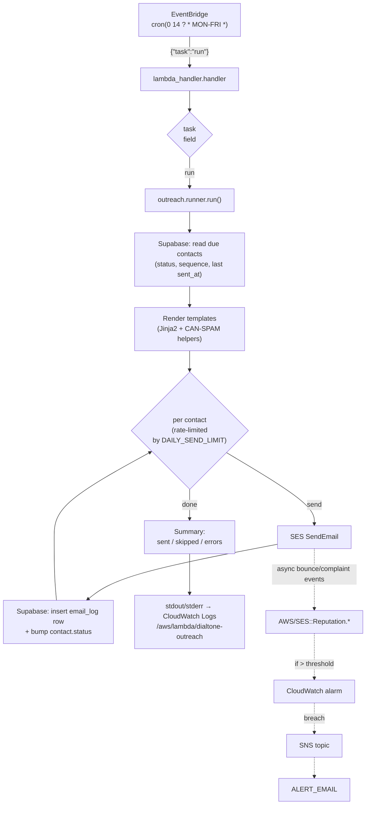
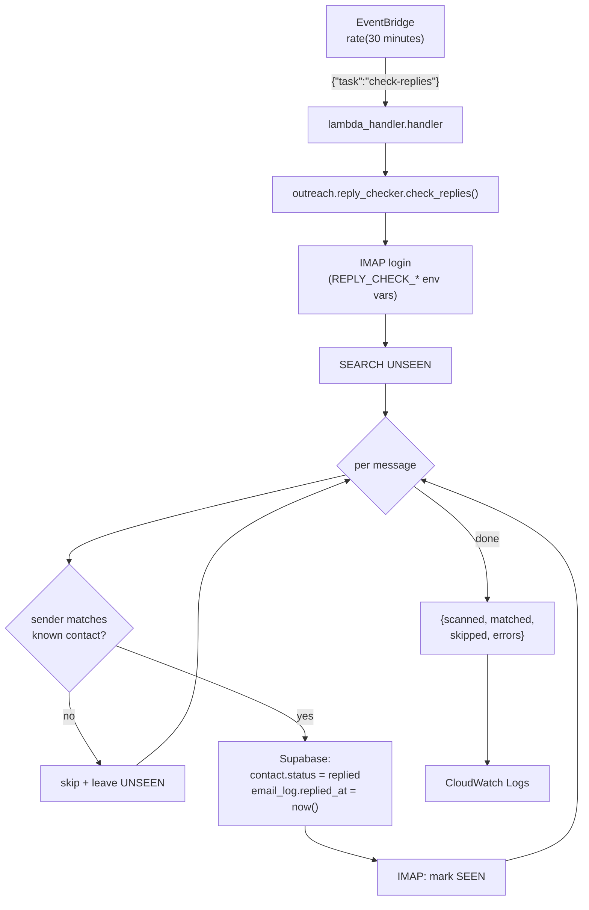
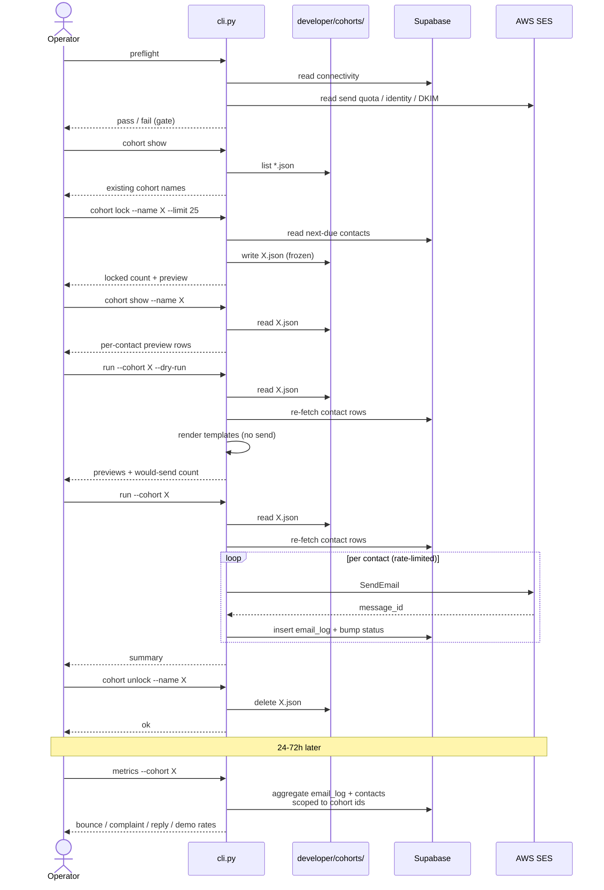
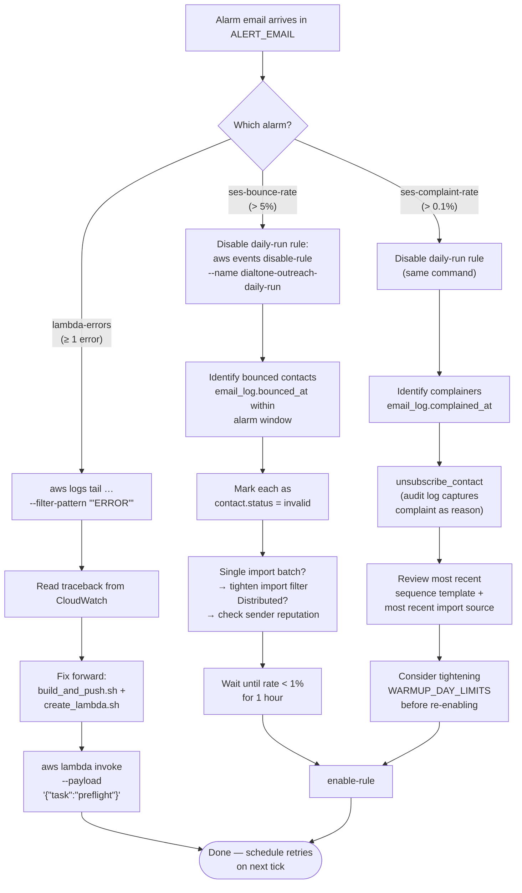

# DialTone Outreach — Production Process Flow

Visual reference for how the production system actually runs.
Complements the prose in [runbook-production.md](runbook-production.md);
the runbook tells you *what to do*, this doc shows *what's happening*.

Every diagram below is a Mermaid block, which GitHub renders inline.
If you're reading raw markdown, the source is still legible.

## 1. Daily automated cycle

What happens each weekday morning when EventBridge fires the daily-run
schedule. Same path runs unattended; no operator interaction in the
happy case.

The dotted edges run *out of band* on AWS's side — bounces and
complaints don't block the Lambda invocation; they show up in
SES's reputation metrics minutes-to-hours later and trigger their
own alarm path.

## 2. Reply detection cycle

Independent schedule, every 30 minutes by default. Pulls unread
mail from the configured IMAP mailbox and marks any matching
contacts as `replied` so the daily-run loop stops emailing them.

The audit-mode CLI (`check-replies --audit [--fix]`) runs against the
same Supabase state without touching IMAP — used to repair drift if
a partial failure leaves `email_log.replied_at` set but `contact.status`
unchanged.

## 3. Manual cohort send (operator-driven)

Off-cadence sends — a custom batch, an A/B test, a re-warm after
a pause. The operator runs every step from the workstation; the
cohort file at `developer/cohorts/<name>.json` is the snapshot
boundary.

Lock is the snapshot boundary — once `X.json` is written, the contact
list is frozen even if Supabase changes underneath. `metrics --cohort X`
works *after* `unlock` because it scopes by contact-id list, not by
the file.

## 4. Alarm response decision tree

When an SNS-fanout email lands in `ALERT_EMAIL`, the response path
depends on which alarm fired. The first move in every case is to
stop the bleed (disable the schedule), then diagnose. Re-enable only
once the root cause is fixed *and* the metric is back inside its band.

`disable-rule` does not delete anything — it leaves the EventBridge
rule, target, and Lambda permission intact, just stops the cron from
triggering. Inverse of `disable-rule` is `enable-rule` with the same
name.

## 5. Emergency pause and resume

Quickest path to halt all production sending. Both schedules go inert;
the function and its image are untouched, so manual `aws lambda invoke`
calls still work for diagnostics during the pause.

```mermaid
flowchart LR
    Trigger["Operator decides<br/>to halt sends"] --> Disable1["disable-rule<br/>dialtone-outreach-daily-run"]
    Disable1 --> Disable2["disable-rule<br/>dialtone-outreach-reply-check"]
    Disable2 --> Diagnose["Diagnose:<br/>logs / metrics / SES console"]
    Diagnose --> Fix["Fix forward<br/>(code patch + redeploy<br/>or AWS-console action)"]
    Fix --> Verify["aws lambda invoke<br/>--payload<br/>'{&quot;task&quot;:&quot;preflight&quot;}'"]
    Verify --> Healthy{"preflight<br/>exit_code 0?"}
    Healthy -->|"no"| Diagnose
    Healthy -->|"yes"| Enable1["enable-rule<br/>dialtone-outreach-daily-run"]
    Enable1 --> Enable2["enable-rule<br/>dialtone-outreach-reply-check"]
    Enable2 --> Resumed(["Production schedule live"])
```

For SES-side emergencies (account-level send pause, identity revoked)
the AWS Console SES dashboard is the source of truth — boto3 doesn't
expose the un-pause flow, so treat it as a manual one-time step.

## Cross-references

- [runbook-production.md](runbook-production.md) — narrative for every
  state in these diagrams (alarm thresholds, exact commands, troubleshooting)
- [runbook-first-cohort.md](runbook-first-cohort.md) — one-time M2 ramp-up
- [deploy/README.md](../deploy/README.md) — initial deploy + branch protection
- [web-ui-guide.md](web-ui-guide.md) — reviewer-facing UI usage
